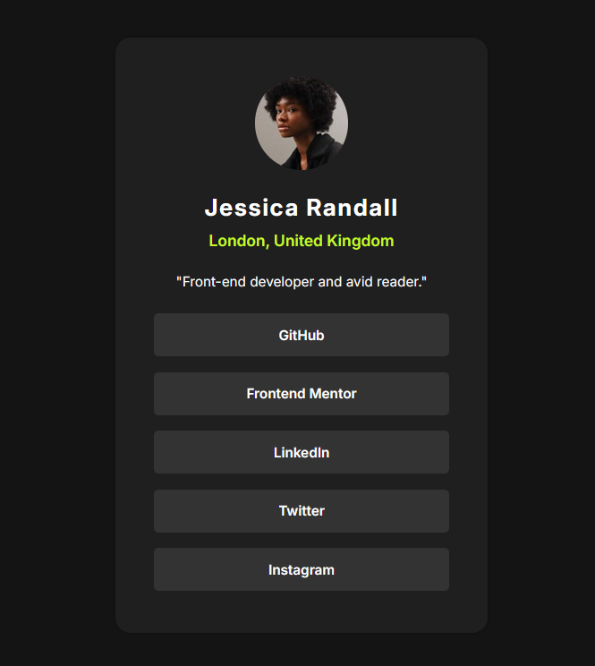

# Frontend Mentor - Social links profile solution

This is a solution to the [Social links profile challenge on Frontend Mentor](https://www.frontendmentor.io/challenges/social-links-profile-UG32l9m6dQ). Frontend Mentor challenges help you improve your coding skills by building realistic projects.

## 目录

- [预览](#预览)
  - [截图](#截图)

## 预览

### 截图



## 我的进程

### 构建方式

- HTML5 编写静态页面
- CSS 编写属性
- line-height 让行内元素居中与容器
- 媒体查询改变容器高宽度

### 我学习到了什么

1、给所有子元素添加间距，使用`last-child`选择最后一个元素清空间距

```css
.social-links__platform li {
  height: 44px;
  line-height: 44px;
  margin-bottom: 16px;
  background-color: var(--grey-700);
  border-radius: 5px;
}

.social-links__platform li:last-child {
  margin-bottom: 0;
}
```
